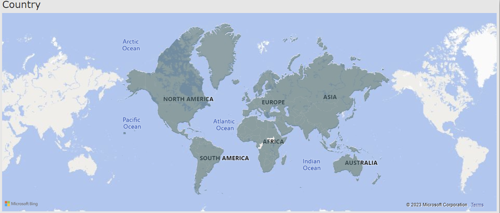
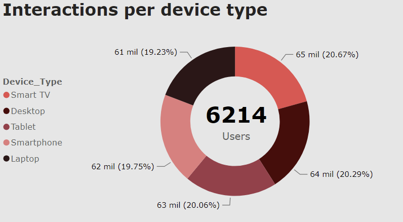
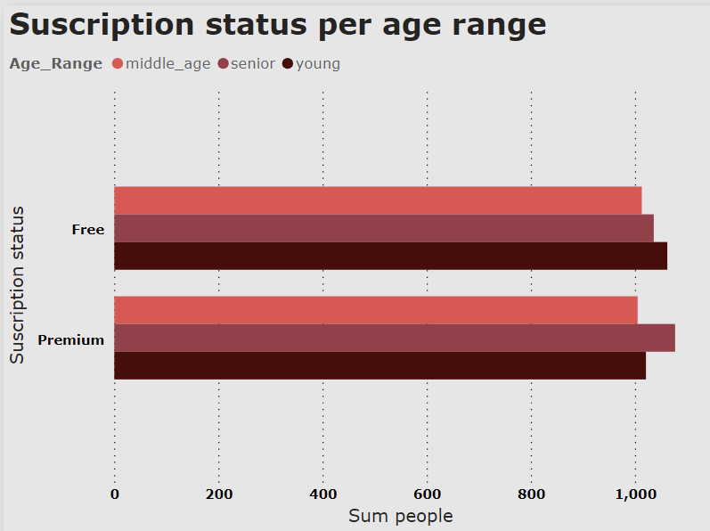
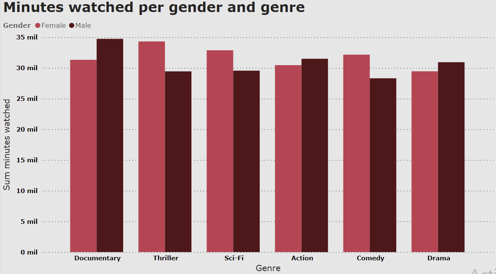

# Visualización con PowerBI 📊

## Plataformas de streaming 🎥

## Descripción 🖋️

El boom de las plataformas de streaming ha sido uno de los fenómenos más destacados en la industria del entretenimiento en los últimos años. Con el aumento del uso de estas plataformas a raíz de la pandemia de COVID-19, se ha vuelto aún más interesante analizar los datos que se generan en estas plataformas.

Los datos que se pueden obtener de una plataforma de streaming son muy valiosos, ya que permiten conocer los hábitos de consumo de los usuarios, sus preferencias de contenido, su ubicación geográfica, entre otros aspectos. Estos datos pueden ser utilizados por las empresas para mejorar la experiencia del usuario, personalizar el contenido y tomar decisiones de negocio más informadas.

Además, el boom de las plataformas de streaming ha generado una gran competencia en el mercado, lo que ha llevado a las empresas a innovar y a ofrecer nuevos servicios y contenidos para atraer a los usuarios. Analizar los datos de estas plataformas puede ayudar a entender mejor esta competencia y a identificar las tendencias del mercado.

Para conseguir datos sobre esto, me he descargado un archivo CSV de Kaggle que contiene la siguiente información sobre una plataforma de streaming:

 
Detalles de las columnas

- **User_ID**: Identificador único del usuario.
- **Session_ID**: Identificador único de la sesión de cada usuario.
- **Device_ID**: Identificador del dispositivo del usuario.
- **Video_ID**: Identificador del vídeo siendo reproducido.
- **Duration_Watched** (minutos): Cantidad de tiempo que el usuario está viendo el vídeo.
- **Genre**: Género del contenido del vídeo (por ejemplo: acción, comedia, drama, etc.).
- **Country**: País en el que se reproduce el vídeo.
- **Age**: Edad del usuario.
- **Gender**: Género del usuario (por ejemplo: masculino y femenino).
- **Subscription_Status**: Estado de suscripción del usuario (por ejemplo: free o premium).
- **Ratings**: Calificación o valoración del usurio (en una escala del 1 al 5).
- **Languages**: Lenguaje del contenido siendo reproducido. 
- **Device_Type**: Tipo de dispositivo utilizado (por ejemplo: móvil, tableta, etc.).
- **Location**: Ubicación o ciudad donde el contenido está siendo reproducido.
- **Playback_Quality**: Calidad del vídeo.
- **Interaction_Events**: Número de interacciones durante la sesión del usuario (por ejemplo: clicks, me gusta, etc.).

 

## Objetivos 🔎

Algunas de las preguntas que se pueden responder con esta visualización son: 

### ¿Cuál es el número total de usuarios de la plataforma y cómo se distribuyen por países? 🌍

Para esto es importante hacer recuento del número de usuarios registrados en la plataforma así como clasificarlos según su país de visionado. 

En este caso, la muestra cuenta con 6.214 datos (personas) distribuidos en 243 países. 

### ¿Qué dispositivo es el que más interacciones recibe? 💻

Mi objetivo era averiguar si hay un dispositivo en concreto que recibe más interacciones o si la distribución es normal. En este caso, el archivo CSV cuenta con registros de dispositivos tales como: 

- Smart TV.
- Ordenador de escritorio. 
- Tablet.
- Smartphone.
- Ordenador portátil.

### ¿Cómo se distribuye el tipo de suscripción de los usuarios según su rango de edad (free o premium)? 💰

Quería descubir si hay una suscripción que sea más común entre unas edades u otras. En este caso, los datos de la muestra se distribuían entre los 10 y los 70 años. Es por esto que decidí clasificar las edades de los usuarios según 3 rangos: 

- Young: entre 10-30 años. 
- Middle-age: entre 30-50 años. 
- Senior: entre 50-70 años.

### ¿Cuántos minutos de visionado hay por género del usuario y género del contenido reproducido? 🚺

A través de estos datos quería ver qué géneros son los más populares entre hombres y mujeres y si hay mucha diferencia de minutos de visionado entre ellos. 

## Conclusiones ✍🏼

Los gráficos mostrados anteriormente muestran los datos generales sin estar filtrados por país. Sin embargo, para esto es para lo que la herramienta de PowerBI es tan interesante, ya que nos permite navegar entre estos datos de manera clara y precisa sin modificarlos en ningún momento. 

Tras haber realizado un análisis exploratorio de los datos estas son algunas de las conclusiones que he podido sacar: 

- Debido a que la muestra de los 6.214 usuarios se divide en 243 países, la media de usuarios por país es de 25.47. La República del Congo es el país con más usuarios con 49, mientras que Gambia es el país con el menor número de usuarios con 14. Esto demuestra que no hay un uso masivo de la plataforma y que por el contrario su uso está muy distribuido entre muchos países. 

- El gráfico de anillos que muestra el número de interacciones por dispositivo demuestra que no hay uno de ellos que supere por mucho al resto, ya que sus valores están equitativamente distribuidos. 

- El gráfico de barras agrupadas que refleja el tipo de suscripción más común según el rango de edad, confirma lo que era de esperar. Es el rango de edad 'young' el que más consume la suscripción 'free', mientras que es el 'senior' el que más consume la 'premium'. Esto se debe principalmente a la diferencia del poder adquisitivo de ambos grupos.

- En cuanto al gráfico de columnas agrupadas que refleja los minutos de visionado, este refleja que no hay una diferencia muy considerable en el tiempo que emplean hombres y mujeres en esta plataforma. Sin embargo, sí se puede concluir que el género más popular entre las mujeres es el de 'thriller' mientras que los hombres prefieren los documentales. 

En definitiva, estos resultados son muy interesantes además de útiles para empresas de streaming si quieren emplear técnicas por ejemplo de marketing para mejorar y aumentar su vínculo con nuevos o ya existentes clientes.